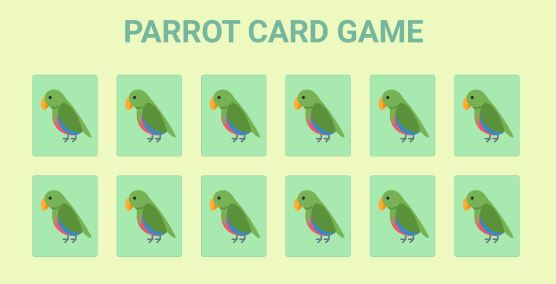
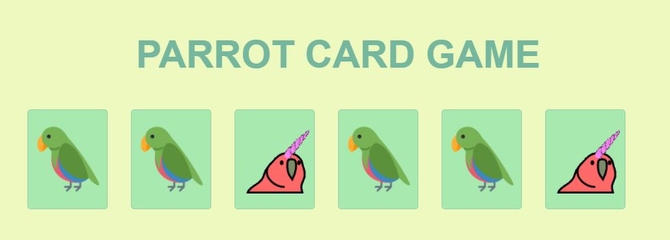

<h1 align="center">
 
  
 
 
Parrot Card Game (Memory Game) 🃏🧠
</h1>

Um jogo da memória temático com aleatoridade, efeitos e transição, responsividade e papagaios dançantes!

  Acesse o site <a href="https://julianadfreitas.github.io/Projeto_04_MemoryGame/"> aqui </a>

  
  
  

[//]: # (Add the features of your project here:)
### Página desenvolvida utilizando CSS, HTML e JavaScript.

### Principais conhecimentos:
- Para a organização do layout: Flex-Box

- JavaScript: prompt, .querySelector, this, setTimeout(), setInterval() e .sort()

